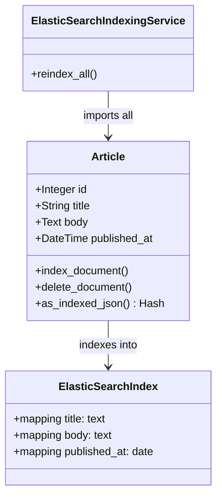

# ドメインモデル: ElasticSearch インデックス登録

## 概要
Article エンティティに ElasticSearch インデックス機能を付与し、記事の永続化イベントに連動してインデックスを自動更新する責務を定義する。

**重要**: このドメインモデル設計では**コードは書かず**、構造と責務の定義のみを行います。実装はImplementation Phase（コード生成ステップ）で行います。

## エンティティ（Entity）

### Article（拡張）
- **ID**: Integer（既存）
- **属性**（既存 + 追加）:
  - `title`: String - 記事タイトル（インデックス対象: text型）
  - `body`: Text - 記事本文（インデックス対象: text型）
  - `published_at`: DateTime - 投稿日時（インデックス対象: date型）
  - `created_at` / `updated_at`: DateTime - Rails標準タイムスタンプ（インデックス非対象）
- **振る舞い**:
  - `index_document`: 自身をElasticSearchインデックスに登録・更新する
  - `delete_document`: 自身のインデックスエントリを削除する
  - `as_indexed_json`: インデックスに保存するJSONを返す（title, body, published_atのみ）

## 値オブジェクト（Value Object）

※ 本Unitでは新規値オブジェクトなし。

## 集約（Aggregate）

### Article集約（拡張）
- **集約ルート**: Article
- **含まれる要素**: Article エンティティ
- **境界**: 記事の保存・削除に連動したインデックス操作を一貫して管理する
- **不変条件**:
  - DBへの保存成功後にインデックス更新を試みる（インデックス失敗はログに記録するが、DB保存は成功扱いとする）
  - インデックスはDBの状態と結果的整合性を持つ（即時整合は保証しない）

## ドメインサービス

### ElasticSearchIndexingService
- **責務**: インデックスの一括再構築（Rake タスクから呼び出される）
- **操作**:
  - `reindex_all`: 全Article レコードをElasticSearchに一括インポートする

## リポジトリインターフェース

### ArticleRepository（拡張）
- **対象集約**: Article
- **操作**（追加）:
  - `create_index!` - インデックスを作成（存在しない場合）
  - `import` - 全レコードを一括インポート

## ドメインモデル図

## ユビキタス言語

- **インデックス**: ElasticSearch 上に保存される検索用データ構造。Article ごとに1エントリ存在する
- **マッピング**: インデックスのフィールド型定義（text/date等）
- **コールバック**: ActiveRecord の `after_commit` フック経由でインデックス操作を呼び出す仕組み
- **Reindex**: 全記事を対象にインデックスを再構築する操作
- **結果的整合性**: DBとインデックスは即時一致しないが、最終的に一致する設計方針

## 不明点と質問

[Question] ElasticSearch 未起動時にアプリ起動をブロックすべきか？
[Answer] ブロックしない。接続エラーはログに記録し、アプリは正常起動する。
