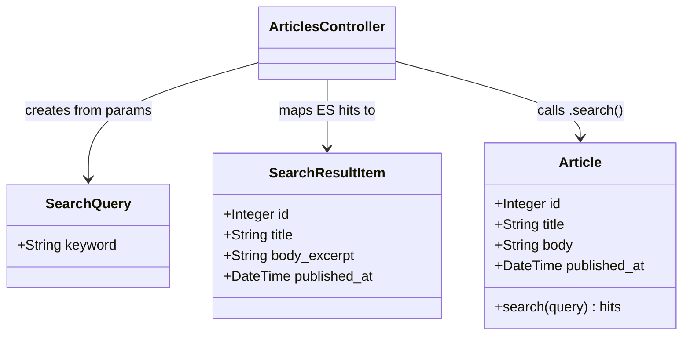

# ドメインモデル: 全文検索機能実装

## 概要
キーワードを受け取り、Article の title および body を横断検索して結果を返す検索ドメインを定義する。
本 Unit はサンプル規模のため、ドメインサービスは設けず Controller が直接 ElasticSearch クエリを実行する。
検索クエリと検索結果は値オブジェクト（DTO）として概念を整理する。

**重要**: このドメインモデル設計では**コードは書かず**、構造と責務の定義のみを行います。実装はImplementation Phase（コード生成ステップ）で行います。

## エンティティ（Entity）

### Article（既存、参照のみ）
- **ID**: Integer
- **属性**:
  - title: String - 記事タイトル（ElasticSearch text 型でインデックス済み）
  - body: String - 記事本文（ElasticSearch text 型でインデックス済み）
  - published_at: DateTime - 投稿日時（ElasticSearch date 型でインデックス済み）
- **振る舞い**:
  - （Unit 002/003 で定義済み。本 Unit では検索対象として参照するのみ）

## 値オブジェクト（Value Object / DTO）

### SearchQuery
- **属性**:
  - keyword: String - 検索キーワード（空文字・nil を許容、空の場合は空結果を返す）
- **不変性**: クエリ文字列は受け取ったまま不変。サニタイズ（strip）は Controller で一度だけ行う
- **等価性**: keyword の値が同一であれば等価

### SearchResultItem（DTO）
- **位置付け**: ドメインオブジェクトではなく、Controller がレスポンス生成に使用する DTO
- **属性**:
  - id: Integer - 記事ID
  - title: String - 記事タイトル
  - body_excerpt: String - 本文抜粋（最大200文字、Controller のマッピング時に truncate を適用）
  - published_at: DateTime - 投稿日時
- **等価性**: id が同一であれば等価

## 集約（Aggregate）

（本 Unit では新規集約は定義しない。Article 集約は Unit 002/003 で定義済み）

## ドメインサービス

（サンプル規模のため、検索ロジックは Controller に直接実装する。ドメインサービスは定義しない）

## ドメインモデル図

## ユビキタス言語

- **SearchQuery（検索クエリ）**: ユーザーが入力した検索キーワードを表す概念
- **SearchResultItem（検索結果アイテム）**: 検索結果の1件を表す DTO（本文抜粋付き）
- **body_excerpt（本文抜粋）**: 本文を最大200文字にトリミングした表示用テキスト（Controller で生成）
- **multi_match クエリ**: ElasticSearch で複数フィールドを横断検索するクエリ種別
- **全文検索**: テキストの部分一致・形態素解析を伴う検索（キーワード検索と区別）
